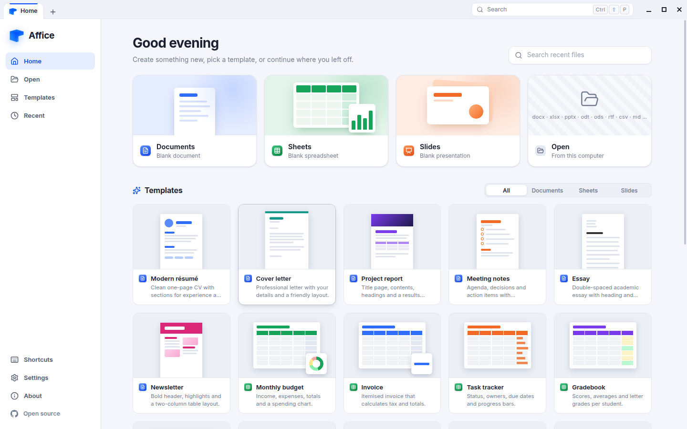
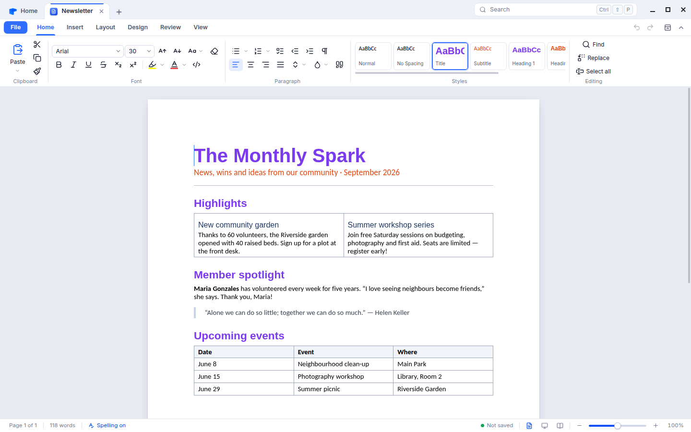
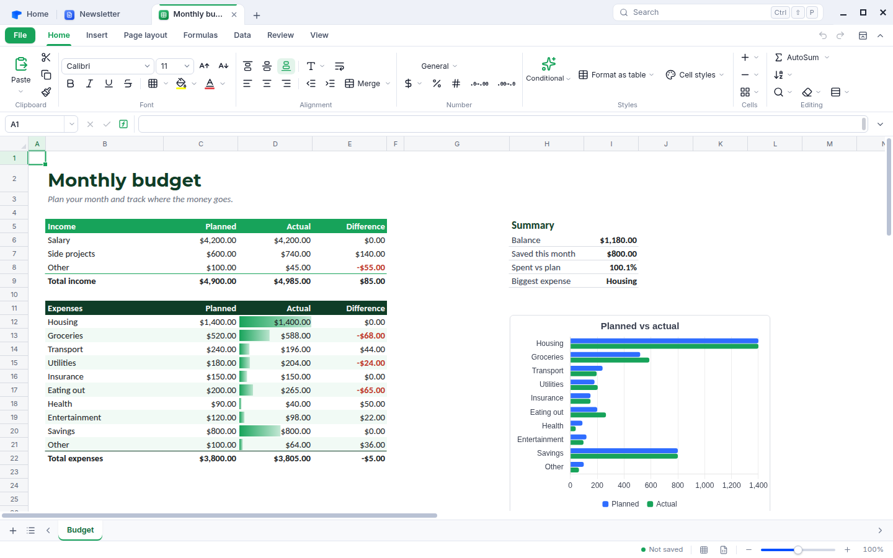
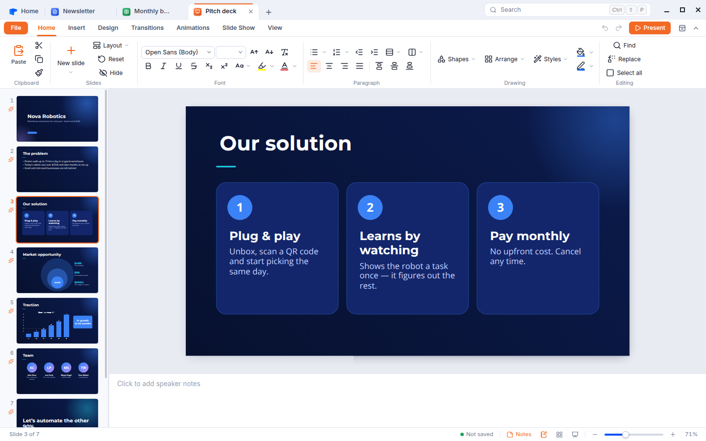
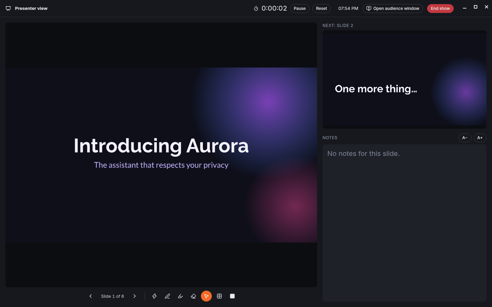
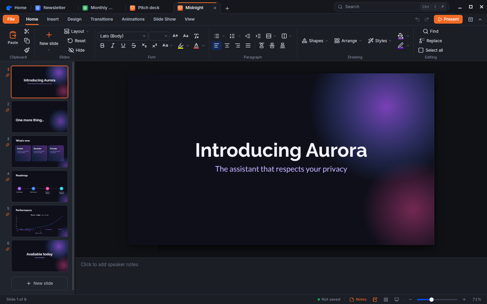

<div align="center">


# Affice

**A free, open-source office suite for Windows and Linux.**
Documents, Sheets and Slides that open and save Microsoft Office and OpenDocument files, with no account, no subscription and no telemetry.

[](https://github.com/andersxns/affice/actions/workflows/build.yml)
[](LICENSE)


<picture>
  <source media="(prefers-color-scheme: dark)" srcset="docs/screenshots/home-dark.png">
  
</picture>

</div>

## Contents

- [Download and install](#download-and-install)
- [What's inside](#whats-inside)
- [File formats](#file-formats)
- [Extras you won't find in Microsoft Office](#extras-you-wont-find-in-microsoft-office)
- [Older and slower computers](#older-and-slower-computers)
- [Keyboard shortcuts](#keyboard-shortcuts)
- [Build from source](#build-from-source)
- [Contributing](#contributing)
- [License](#license)

## Download and install

Installers for Windows and Linux are built automatically by the [Build workflow](https://github.com/andersxns/affice/actions/workflows/build.yml). There are two places to get them:

- **Releases**: each version is published on the [**Releases page**](https://github.com/andersxns/affice/releases/latest), with every file listed below and a `SHA256SUMS.txt` to check your download.
- **Latest build**: every change to the default branch is built too. Open the newest run with a green tick in the [Build workflow](https://github.com/andersxns/affice/actions/workflows/build.yml), scroll down to **Artifacts** and download **affice-Windows** or **affice-Linux**. Each is a zip with all the files below for that system. You need to be signed in to GitHub, and builds are kept for 90 days.

### Windows (10 and 11)

| File | Use it for |
| --- | --- |
| `Affice-Setup-<version>-x64.exe` | The normal installer. Pick this one if you're not sure. |
| `Affice-Setup-<version>-ia32.exe` | Installer for older 32-bit PCs. |
| `Affice-Setup-<version>-arm64.exe` | Installer for Windows on ARM (Surface Pro X, Snapdragon laptops…). |
| `Affice-Portable-<version>-x64.exe` | Runs without installing, from a folder or USB stick. |

The installer lets you choose where Affice goes and whether it is installed just for you (no administrator rights needed) or for everyone. It adds Start menu and desktop shortcuts and lets Affice open `.docx`, `.xlsx`, `.pptx`, `.odt`, `.ods`, `.odp` and the other supported files. The installers aren't code-signed yet, so Windows SmartScreen may warn you the first time; choose **More info → Run anyway**.

### Linux

| File | Use it for |
| --- | --- |
| `Affice-<version>-x86_64.AppImage` / `-arm64.AppImage` | Any distribution. Make it executable (`chmod +x Affice-*.AppImage`) and run it. Needs `libfuse2`. |
| `affice_<version>_amd64.deb` / `_arm64.deb` | Debian, Ubuntu, Linux Mint, Pop!_OS… `sudo apt install ./affice_<version>_amd64.deb` |
| `affice-<version>.x86_64.rpm` | Fedora, openSUSE, RHEL… `sudo dnf install ./affice-<version>.x86_64.rpm` |
| `Affice-<version>-x64.tar.gz` / `-arm64.tar.gz` | Unpack anywhere and run `./affice`. |

Affice runs on current 64-bit distributions (for example Ubuntu 20.04, Debian 11, Fedora 36 or newer).

### Optional: LibreOffice for very old formats

Affice reads and writes Word, Excel, PowerPoint, OpenDocument, RTF and many other formats itself. For a few legacy formats it hands the conversion to [LibreOffice](https://www.libreoffice.org/) if it is installed: saving `.doc`, opening and saving `.ppt`, and opening Keynote, Pages, WordPerfect and similar files. Everything else works without it.

## What's inside

### Dashboard

A home screen to start a blank document, spreadsheet or presentation, choose from 16 templates, open files (or drag them in), and pick up recent work. Everything opens in tabs, so a report, its budget and the presentation about it sit side by side. Press <kbd>Ctrl</kbd>+<kbd>Shift</kbd>+<kbd>P</kbd> to search every command, recent file and setting.

### Documents



- Print layout with real pages, margins, orientation, paper sizes and page breaks
- Headers and footers, page numbers, watermark and page colour
- Styles gallery (Normal, Title, Headings…), style sets and theme fonts
- Tables with styles, merged cells, shading and borders; pictures with alt text, sizing and text wrapping
- Numbered, bulleted and checklist lists, quotes, code blocks, symbols and LaTeX equations
- Comments and links, a table of contents built from your headings, navigation pane and word count
- Find and replace, spelling check, read-aloud, read mode and focus mode
- Slash commands: type <kbd>/</kbd> to insert a heading, table, list, picture or equation

### Sheets



- About 490 Excel-compatible functions, including dynamic arrays (`FILTER`, `SORT`, `UNIQUE`, `SEQUENCE`), `XLOOKUP`, `LET` and `LAMBDA` with `MAP`, `REDUCE` and `BYROW`, plus text, date, financial and statistical functions
- Fast canvas grid that stays smooth with large sheets; freeze panes; insert, hide and resize rows and columns
- Number formats (currency, accounting, dates, percentages, fractions, custom codes)
- Conditional formatting: highlight rules, data bars, colour scales, icon sets and formula rules
- Charts (column, bar, line, area, pie, doughnut, scatter, radar, combo) that update with the data
- Format as table, cell styles, merge, wrap, rotate, borders and fill
- Sort, filter, remove duplicates, text to columns, flash fill, data validation with dropdowns and checkboxes
- Goal seek, forecasting, quick statistics, defined names and formula auditing (trace precedents and dependents)
- Notes, sheet protection, print areas, repeated title rows and PDF export

### Slides



- 12 designs, colour palettes and font pairs, plus the standard PowerPoint layouts
- About 100 shapes, text boxes, pictures (with crop and picture shapes), 1,500+ icons, tables and charts
- One-click buttons in empty placeholders to add a table, chart, picture or icon
- Smart guides and snapping, rotation, alignment and distribution, grouping and the format painter
- Transitions (fade, push, wipe, split, cover, zoom, **morph** and more) and entrance, emphasis and exit animations with an animation pane
- Slide show with a presenter view (next slide, notes, timer), pen, highlighter, laser pointer, slide grid, and black or white screen
- In the desktop app the audience window opens full screen on a second display automatically
- Speaker notes, hidden slides, slide sorter, header and footer, slide numbers



### Everywhere

- Light and dark themes (or follow the system), accent colours and a simplified single-row ribbon
- A ribbon that fits small screens: groups tighten and fold into buttons instead of disappearing
- Autosave and crash recovery, plus optional automatic saving back to the original file
- Fonts that match Office's metrics (Carlito for Calibri, Caladea for Cambria, Arimo for Arial, Tinos for Times New Roman, Cousine for Courier New) are built in, and they also stand in for LibreOffice's Liberation fonts, so Office and LibreOffice documents keep their line and page breaks even when those fonts aren't installed
- Works fully offline and never phones home



## File formats

| | Opens | Saves | Exports |
| --- | --- | --- | --- |
| **Documents** | `.docx` `.docm` `.dotx` `.odt` `.ott` `.rtf` `.doc` `.html` `.md` `.txt` `.afdoc` (+ WordPerfect, Pages and more with LibreOffice) | `.docx` `.odt` `.rtf` `.afdoc` (`.doc` with LibreOffice) | PDF, HTML, Markdown, EPUB, plain text |
| **Sheets** | `.xlsx` `.xlsm` `.xltx` `.xls` `.xlsb` `.ods` `.ots` `.fods` `.numbers` `.csv` `.tsv` `.afsheet` | `.xlsx` `.ods` `.xls` `.afsheet` | PDF, CSV, TSV, HTML, JSON, Markdown |
| **Slides** | `.pptx` `.pptm` `.potx` `.ppsx` `.odp` `.otp` `.fodp` `.afslides` (+ `.ppt` `.key` with LibreOffice) | `.pptx` `.odp` `.afslides` | PDF, PNG (one slide or all), self-contained HTML slide show, Markdown outline |

The `.afdoc`, `.afsheet` and `.afslides` formats are Affice's own compressed JSON files. They keep every Affice feature exactly and are documented by the TypeScript types in `src/*/model`.

## Extras you won't find in Microsoft Office

- **Free and open**: every feature, forever, with no account, subscription or ads, under the MIT license
- **Web slide shows**: export a presentation as one `.html` file that plays, with its fonts, transitions and animations, in any browser
- **E-books and plain text**: save documents as EPUB or Markdown; export sheets as JSON or Markdown tables; turn a deck into a Markdown outline
- **More files open directly**: Apple Numbers spreadsheets and Markdown documents open without converters
- **Search everything**: a command palette for every command, file and setting
- **Regular-expression find** in Sheets
- **A 1,500-icon library** in Slides, free
- **Fair on older hardware**: a performance mode and adjustable motion (see below)
- **Linux**, as a first-class platform

## Older and slower computers

Affice is built to stay responsive on modest hardware:

- Each editor loads only when you open it, and the spreadsheet grid is drawn on a canvas, so large sheets stay smooth
- **Settings → Performance mode** turns off blur, heavy shadows and background effects
- **Settings → Motion** chooses full, reduced or no animation (the system's "reduce motion" preference is respected)
- **Settings → Hardware acceleration** can be switched off for old or problematic graphics drivers
- **Settings → Density** and **UI scale** fit more on small screens, and the ribbon adapts down to 1024-pixel-wide windows
- 32-bit Windows and ARM64 builds are provided

## Keyboard shortcuts

Affice uses the shortcuts you already know from Office: <kbd>Ctrl</kbd>+<kbd>S</kbd> save, <kbd>Ctrl</kbd>+<kbd>Z</kbd>/<kbd>Y</kbd> undo and redo, <kbd>Ctrl</kbd>+<kbd>B</kbd>/<kbd>I</kbd>/<kbd>U</kbd>, <kbd>Ctrl</kbd>+<kbd>F</kbd>/<kbd>H</kbd> find and replace, <kbd>Ctrl</kbd>+<kbd>P</kbd> print, <kbd>F5</kbd> start a slide show, <kbd>Ctrl</kbd>+<kbd>M</kbd> new slide, <kbd>Ctrl</kbd>+<kbd>1</kbd> format cells, and many more. The full list is under **Shortcuts** on the dashboard.

## Build from source

You need [Node.js](https://nodejs.org/) 22 or newer and Git.

```bash
git clone https://github.com/andersxns/affice.git
cd affice
npm install
npm run dev          # the desktop app with hot reload
```

Other useful scripts:

| Command | What it does |
| --- | --- |
| `npm run dev:web` | Runs the interface in a browser at http://localhost:5173 (no desktop features) |
| `npm run typecheck` | Type-checks the app and the Electron main process |
| `npm test` | Runs the unit tests (formula engine, number formats, OpenDocument spreadsheet and presentation files) |
| `npm run build` | Builds the renderer and the Electron main process into `dist/` and `dist-electron/` |
| `npm run dist:win` | Builds the Windows installer and portable app into `release/` |
| `npm run dist:linux` | Builds the AppImage, `.deb`, `.rpm` and `.tar.gz` into `release/` (`.rpm` needs `rpmbuild`) |

Pushing a tag such as `v1.0.1` makes the [Build workflow](.github/workflows/build.yml) build every installer and publish them as a GitHub release.

### Tech stack

[Electron](https://www.electronjs.org/), [React](https://react.dev/), [TypeScript](https://www.typescriptlang.org/) and [Vite](https://vite.dev/). The word processor is built on [TipTap](https://tiptap.dev/)/[ProseMirror](https://prosemirror.net/); Sheets has its own formula engine and canvas grid; Slides renders with HTML and SVG. Office files are read and written with [ExcelJS](https://github.com/exceljs/exceljs), [SheetJS](https://sheetjs.com/), [docx](https://docx.js.org/) and Affice's own OOXML and ODF code; charts use [Chart.js](https://www.chartjs.org/) and icons come from [Lucide](https://lucide.dev/).

## Contributing

Bug reports, ideas and pull requests are welcome. See [CONTRIBUTING.md](CONTRIBUTING.md) for how the code is organised and how to get started.

## License

Affice is released under the [MIT License](LICENSE).

It bundles open-source components under their own licenses, including Electron (MIT), React (MIT), TipTap and ProseMirror (MIT), ExcelJS (MIT), SheetJS Community Edition (Apache-2.0), Chart.js (MIT), KaTeX (MIT), Lucide (ISC) and fonts from Google Fonts and the Chrome OS core fonts via Fontsource (SIL Open Font License 1.1). Microsoft Office, Word, Excel and PowerPoint are trademarks of Microsoft Corporation; Affice is not affiliated with Microsoft.
